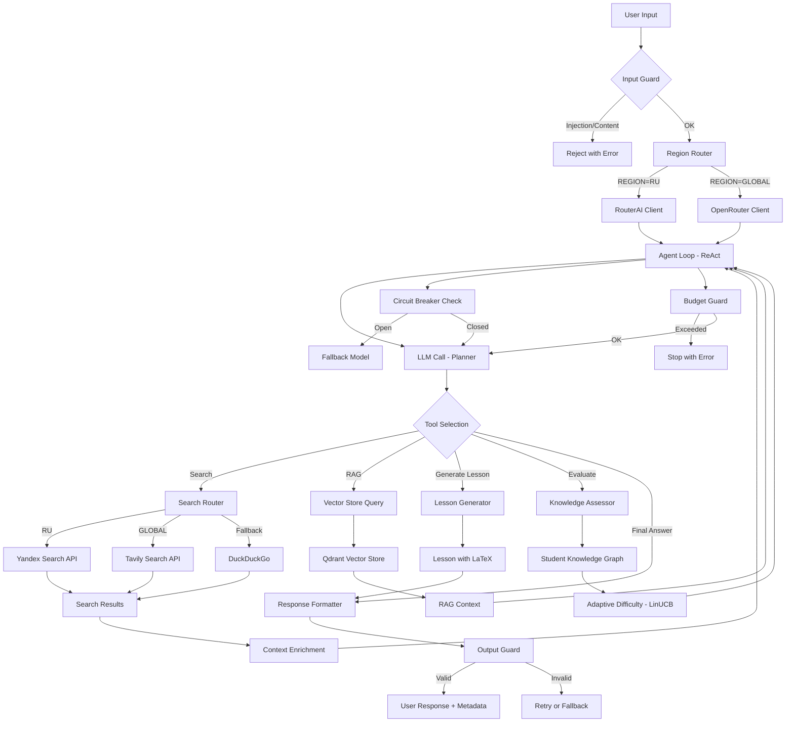

# Adaptive Tutor — Архитектура

## Диаграмма агентного цикла (Mermaid)

## Фабрики

### LLMClientFactory (src/llm/base.py)
- `get_client(region)` — возвращает `RouterAIClient` (RU) или `OpenRouterClient` (Global).
- Каждому клиенту подключается провайдер-специфичный `TokenCounter`.

### TokenCounter (Strategy Pattern)
- `TokenUsage` — нормализованная модель токенов/стоимости.
- `RouterAITokenCounter` — извлекает `usage.cost` в **рублях**, курс RUB→USD.
- `OpenRouterTokenCounter` — извлекает `usage.cost` в **credits** (≈USD).
- Поля токенов извлекаются через безопасные get-цепочки, т.к. их расположение
  в JSON-ответе у провайдеров различается.

### SearchRouter (src/search/base.py)
- `get_engines(region)` — упорядоченный список поисковиков.
- RU: Yandex → DuckDuckGo. Global: Tavily → DuckDuckGo.
- `search()` — перебор движков с fallback при ошибке.